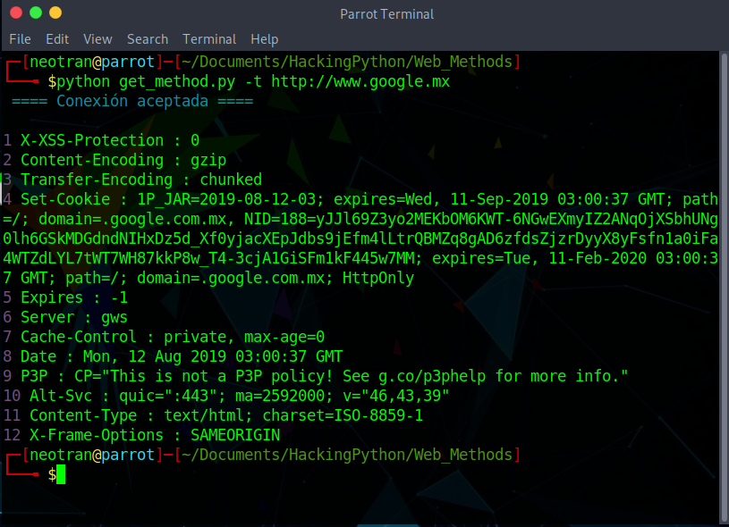
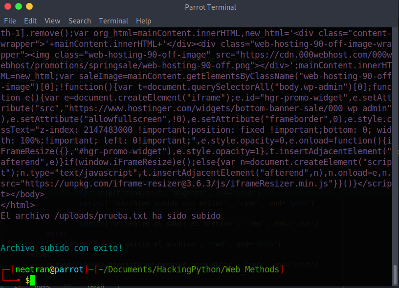
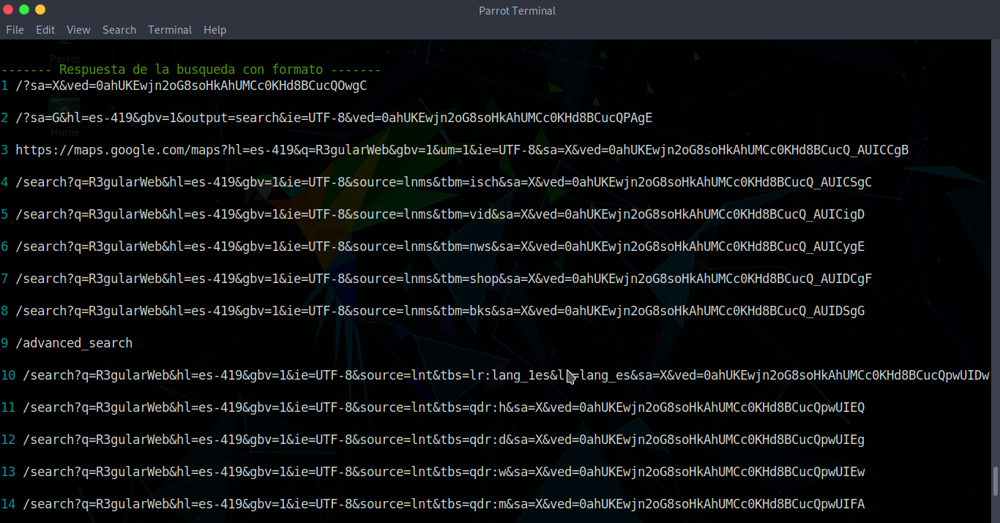
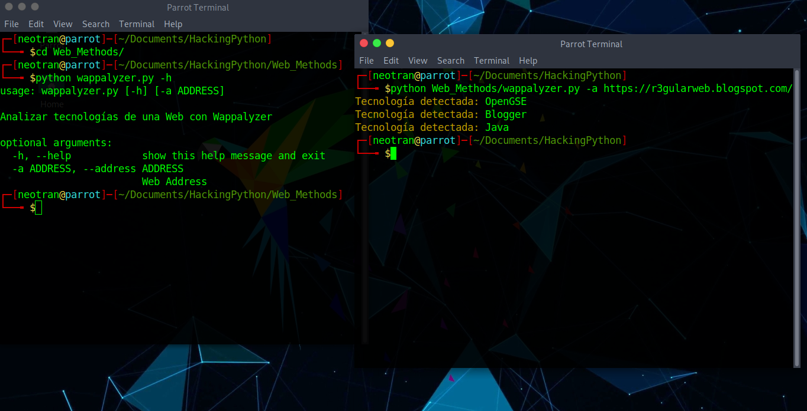

# Get Method

* Use: python get_method -t TARGET_ADDRESS

# Post Method

* Use: python post_method -f FILE_ADDRESS

# Forms Mechanize (Google search)

* Use: python forms1_mechanize -b TEXT

# Wappalyzer (Web Analyzer)

* Use: python wappalyzer.py --address WEB_ADDRESS
